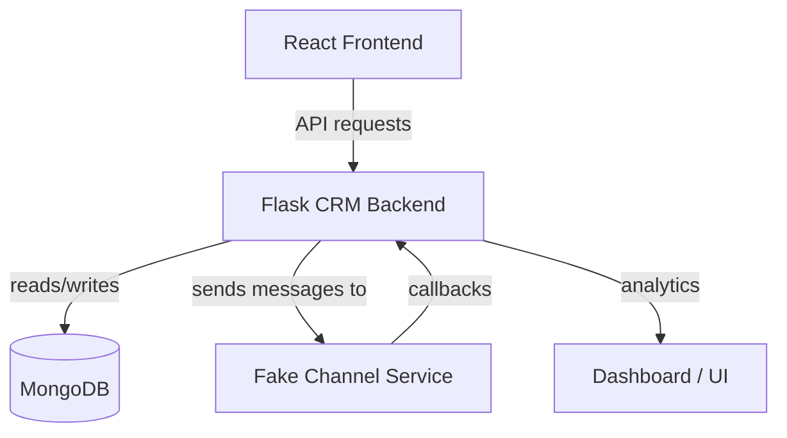

# Xeno CRM (TrendWear) — Local Demo

## Project overview
A lightweight CRM demonstration for the Xeno assignment. It includes:
- Flask-based CRM backend (`crm-backend`) with MongoDB persistence
- Fake channel service (`fake-channel-service`) that simulates message delivery and posts receipts back to the CRM
- React + Vite frontend (`frontend`) that manages customers, segments, campaigns and shows analytics
- AI-assisted endpoints (uses Gemini or mock fallback) for message generation and segment suggestions

## Tech stack
- Backend: Python, Flask, pymongo
- Fake channel: Python, Flask
- Frontend: React, Vite
- DB: MongoDB (Atlas or local)

## Architecture


## Environment files (recommended)
Create the following `.env` files to avoid port confusion:

- `frontend/.env`
```
VITE_API_BASE_URL=http://localhost:5002/api
```

- `crm-backend/.env`
```
PORT=5002
MONGO_URI=your_mongodb_uri
GEMINI_API_KEY=your_gemini_key
FAKE_CHANNEL_URL=http://localhost:5001/send-message
CRM_CALLBACK_URL=http://localhost:5002/api/receipts
```

- `fake-channel-service/.env`
```
PORT=5001
CRM_CALLBACK_URL=http://localhost:5002/api/receipts
```

> Notes: The repo already contains `.env` files; update the placeholders with your credentials.

## How to run locally
Start the CRM backend:

```bash
cd crm-backend
python3 -m venv .venv
. .venv/bin/activate
pip install -r requirements.txt
# If 5000 is in use, use the recommended PORT in .env (5002)
PORT=5002 python app.py
```

Start the fake channel service:

```bash
cd fake-channel-service
python3 -m venv .venv
. .venv/bin/activate
pip install -r requirements.txt
python app.py
```

Start the frontend (dev):

```bash
cd frontend
npm install
# bind to LAN and set API base to crm backend running on 5002
VITE_API_BASE_URL=http://localhost:5002/api npm run dev -- --host
```

## Core flows supported
1. Create customers / seed demo data
2. Create segments (manual or AI-suggested)
3. Create campaigns and generate AI messages
4. Send campaigns (backend calls channel endpoint for each communication)
5. Fake channel simulates delivery lifecycle and POSTs receipts to `/api/receipts`
6. CRM aggregates receipts and updates campaign analytics visible in the UI

## API endpoints (selected)
- `GET /api/health` — health + DB connectivity
- `GET /api/dashboard/stats` — aggregated metrics
- `GET|POST /api/customers` — list / generate demo
- `GET|POST /api/segments` — segments
- `GET|POST /api/campaigns` — campaigns (send at `/api/campaigns/:id/send`)
- `POST /api/receipts` — delivery callbacks
- `POST /api/ai/*` — AI helpers (`suggest-segments`, `generate-message`, `campaign-assistant`)

## Observations & runtime notes
- The CRM will try MongoDB Atlas first and fall back to `localhost:27017` if Atlas is unreachable.
- The AI integration attempts to use Gemini; if the provider SDK is incompatible or API key is missing the app falls back to mock responses (see logs: "Using mock fallback").
- Development servers use Flask's dev server and Vite; they are not production-grade.

## Analytics enhancements to add (recommended for demo)
- Expose metrics in campaign view: Sent / Delivered / Failed / Opened / Clicked / Converted / Attributed orders
- Simulate conversions if your seed data includes orders or add a conversion-simulator in the fake channel

## Deployment suggestions
- Frontend: Vercel (deploy `frontend` build)
- Backend & Fake Channel: Render or Heroku (container or service) — ensure env vars are set and ports are open
- Database: MongoDB Atlas (setup IP allowlist; update `MONGO_URI`)

## Deployment guide

### 1. MongoDB Atlas
1. Create an Atlas cluster and a database user.
2. Add your deploy IPs to the Atlas Network Access allowlist.
3. Replace `crm-backend/.env` with the Atlas connection string:

```bash
MONGO_URI=mongodb+srv://<user>:<password>@<cluster>/<db>?retryWrites=true&w=majority
```

### 2. CRM Backend on Render
1. Create a new Render Web Service from the `crm-backend` folder.
2. Use Python 3.9+ and install from `requirements.txt`.
3. Set these environment variables on Render:

```bash
PORT=5002
MONGO_URI=...
GEMINI_API_KEY=...
FAKE_CHANNEL_URL=https://<your-render-fake-channel>/send-message
CRM_CALLBACK_URL=https://<your-render-crm>/api/receipts
```

4. Start command:

```bash
python app.py
```

### 3. Fake Channel Service on Render
1. Create a second Render Web Service from `fake-channel-service`.
2. Set:

```bash
PORT=5001
CRM_CALLBACK_URL=https://<your-render-crm>/api/receipts
```

3. Start command:

```bash
python app.py
```

### 4. Frontend on Vercel
1. Import the `frontend` folder into Vercel.
2. Set the environment variable:

```bash
VITE_API_BASE_URL=https://<your-render-crm>/api
```

3. Build command: `npm run build`
4. Output directory: `dist`

### 5. Post-deploy checks
- Open the frontend and confirm dashboard stats load.
- Send a campaign and confirm receipts arrive at `/api/receipts`.
- Open campaign analytics and verify open/click/converted metrics update.
- Ensure AI Copilot calls are returning non-error responses.

## Tradeoffs & future improvements
- Replace Flask dev server with Gunicorn + Uvicorn or similar for production
- Persist message delivery latency and attribution rules for better analytics
- Add authentication for backend and secure AI API keys using secrets manager

---

If you want, I can now:
- Verify end-to-end campaign send by creating a sample segment, campaign, and sending it (I can trigger this from the backend or via the frontend). 
- Add UI buttons/pages to expose the AI features more prominently.
- Implement simulated conversion attribution into analytics.

Which of these should I do next?